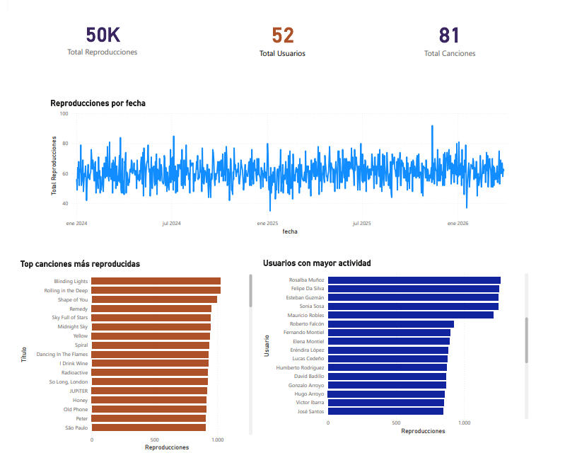
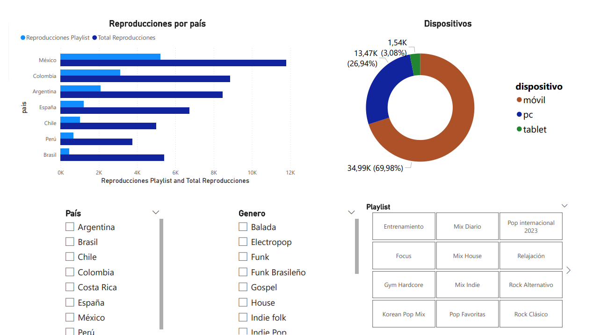

# 🎧 Dashboard de Streaming de Música - Power BI

## 📊 Descripción
Este proyecto consiste en el desarrollo de un dashboard interactivo en Power BI para analizar datos de una plataforma de streaming de música.

El objetivo es visualizar el comportamiento de los usuarios, identificar tendencias de reproducción y facilitar la toma de decisiones a partir de los datos.

---

## 🎯 Objetivos
- Analizar reproducciones por país
- Analizar reproducciones por dispositivo
- Explorar canciones y artistas más escuchados
- Permitir la interacción mediante filtros (slicers)

---

## 📁 Estructura del Dashboard

El dashboard está dividido en las siguientes secciones:

### Vista General
- Métricas principales:
  - Total de reproducciones
  - Total de usuarios
  - Total de canciones
- Resumen general del comportamiento

### Análisis por Canciones y Usuarios
- Top canciones más reproducidas
- Usuarios con mayor número de reproducciones

### Análisis por País
- Gráfico de barras con reproducciones por país
- Identificación de regiones con mayor actividad

### Análisis por Dispositivo
- Distribución de uso por dispositivo (móvil, PC, tablet)
- Comparación de preferencias de acceso

---

## ⚙️ Tecnologías utilizadas
- Power BI Desktop
- MySQL
- DAX (Data Analysis Expressions)

---

## 🗄️ Configuración de la base de datos
Antes de usar el dashboard, es necesario crear y poblar la base de datos.

### 1. Crea base de datos y tablas
 Ejecuta el script `databases/schema.sql` para crear la base de datos y las tablas

### 2. Insertar datos
 Inserta los datos de prueba del script `databases/data.sql`

---

## 🔌 Conexión a la base de datos (ODBC)
El dashboard utiliza una conexión ODBC para acceder a MySQL.

### Requisitos
- MySQL instalado y en ejecución
- MySQL ODBC Driver instalado

### Pasos
1. Configurar un DSN para la base de datos `streaming_musica`
2. Abrir Power BI Desktop
3. Seleccionar Obtener datos → ODBC
4. Elegir el DSN configurado
5. Cargar las tablas necesarias
⚠️ El nombre del DSN debe coincidir con el utilizado en el archivo .pbix

---

## 🚀 Cómo usar
1. Configurar la base de datos en MySQL (ver sección anterior)
2. Configurar la conexión ODBC
3. Abrir el archivo `powerbi/streaming_musica.pbix` en Power BI Desktop  
4. Navegar entre las páginas del dashboard  
5. Utilizar los slicers para filtrar la información  
6. Analizar los resultados en las visualizaciones  

---

## 🔄 Interactividad
El dashboard incluye:
- Slicers por país, género y playlist
- Filtros dinámicos entre visualizaciones
- Navegación entre páginas

---

## 📷 Vista previa

### Vista general del dashboard principal

Este panel muestra una visión global del sistema, incluyendo métricas
clave como total de reproducciones, usuarios y canciones.

---

### Análisis detallado de reproducciones

Permite identificar los países con mayor número de reproducciones y comparar el comportamiento entre regiones. También muestra la distribución del uso de la plataforma según el tipo de dispositivo.
 
---

## 📊 Insights del análisis

A partir de los datos analizados en el dashboard, se observan los siguientes patrones:

- México presenta el mayor número de reproducciones dentro del conjunto de datos.  
- El uso de dispositivos móviles es predominante frente a otras opciones.  
- Algunas canciones concentran más reproducciones que otras, mostrando diferencias en popularidad.  
- Existen usuarios con mayor actividad en comparación con el resto.  

---

## 📌 Notas
- Estos hallazgos se basan en un conjunto de datos de tamaño reducido, por lo que su propósito es demostrar capacidades de análisis y visualización.
- Algunos filtros aplican únicamente a visualizaciones específicas  
- Los datos están estructurados para análisis exploratorio  

---

## 👩‍💻 Autor
Bárbara Badillo